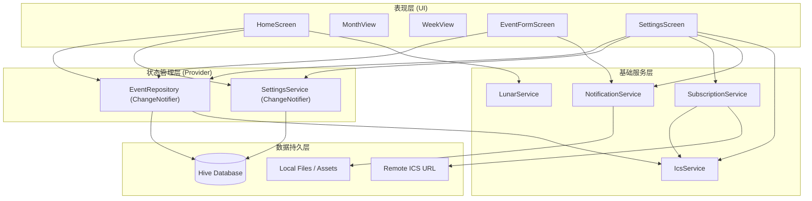

# TCamp 日历：产品技术报告

## 1. 产品功能介绍

TCamp 日历是一款基于 Flutter 开发的跨平台日历应用，旨在提供高效、本地化且功能丰富的日程管理体验。其核心功能包括：

*   **多视图日历展示**：支持**月视图**、**周视图**和**日视图**切换，满足用户对不同时间维度的查看需求。
*   **日程事件管理**：
    *   支持创建、编辑和删除日程事件。
    *   支持设置事件标题、描述、地点及起止时间。
    *   **重复规则支持**：遵循 RFC 5545 标准，支持按日、周、月、年设置重复事件（Recurring Events）。
    *   **提醒功能**：支持为事件设置自定义时间的本地通知提醒。
*   **中国农历支持**：
    *   深度集成农历显示，包括农历日期（如“初一”、“十五”）。
    *   支持展示干支纪年（如“甲辰年”）及生肖（如“龙”）。
    *   仅在中文语言环境下自动启用，体验更符合国人习惯。
*   **日历订阅与同步**：支持通过 URL 订阅外部 ICS (iCalendar) 日历源，实现日程信息的导入与查看。
*   **数据管理与隐私**：
    *   **数据清除**：支持一键清除所有日程事件、订阅源、用户设置及已调度的本地通知。
    *   **安全机制**：操作需经过二次确认，确保数据安全，清除后应用即恢复至初始安装状态。
*   **国际化与主题**：
    *   支持多语言切换（目前重点优化中文体验）。
    *   适配系统亮色/暗色模式。
    *   离线字体支持（Google Fonts 离线配置）。

## 2. 程序概要设计

本应用采用 **MVVM (Model-View-ViewModel)** 架构思想，结合 `Provider` 进行状态管理和依赖注入。系统主要分为以下几个层级：

*   **表现层 (Presentation Layer)**：
    *   由 `screens/`（如 `HomeScreen`, `EventFormScreen`）和 `widgets/` 组成。
    *   负责 UI 渲染及响应用户交互，通过 `Provider.of` 或 `Consumer` 监听数据变化。
*   **业务逻辑层 (Domain/Logic Layer)**：
    *   **Services**：处理具体的功能逻辑，如 `LunarService`（农历转换）、`IcsService`（文件解析）、`NotificationService`（通知调度）。
    *   **Repositories**：即 `EventRepository`，作为单一数据源，协调数据的增删改查及缓存逻辑，向 UI 层暴露 `ChangeNotifier` 接口。
*   **数据层 (Data Layer)**：
    *   **Local Storage**：使用 **Hive** NoSQL 数据库进行高性能的结构化数据存储。
    *   **Remote Data**：通过 `http` 客户端获取远程 ICS 文件流。

## 3. 软件架构图

## 4. 技术亮点及其实现原理

### 4.1 深度农历集成 (Deep Lunar Integration)
*   **亮点**：应用不仅显示简单的农历日期，还能根据当前的 `Locale` 智能判断是否开启。仅在中文环境下展示完整的干支、生肖及节气信息。
*   **实现原理**：
    *   封装了 `LunarService` 类，内部依赖 `lunar` 库的核心算法。
    *   通过 `Solar.fromDate(date).getLunar()` 将公历日期转换为农历对象。
    *   实现 locale 嗅探逻辑 `_isChineseLocale`，解析语言代码（如 `zh`），确保非中文用户界面清爽。
    *   格式化输出做了特殊处理：月初显示月份（如“正月”），非月初显示日期（如“初五”），符合传统阅读习惯。

### 4.2 RFC 5545 重复规则解析 (Recurrence Rule Parsing)
*   **亮点**：实现了标准的 iCalendar 重复规则（RRULE）解析，能够处理复杂的周期性事件。
*   **实现原理**：
    *   定义 `RRule` 模型类，包含 `frequency`, `interval`, `count`, `until` 等标准属性。
    *   实现了自定义解析器 `RRule.parse(String raw)`，通过分割字符串（split `;` 和 `=`）将 `FREQ=WEEKLY;INTERVAL=2` 等指令映射为 Dart 对象。
    *   利用 Dart 的 `Enums` (`RecurrenceFrequency`) 强类型管理重复频率，确保逻辑的严密性。

### 4.3 时区感知的精准通知 (Timezone-Aware Notifications)
*   **亮点**：通知系统能够感知设备时区变化，确保跨时区旅行时提醒时间依然准确。
*   **实现原理**：
    *   使用 `flutter_local_notifications` 配合 `timezone` 库。
    *   在 `NotificationService` 中，利用 `tz.TZDateTime` 将本地时间转换为带时区信息的绝对时间对象。
    *   使用 `zonedSchedule` 方法注册通知，允许系统在特定时区的绝对时刻触发提醒，通过 `androidScheduleMode: exactAllowWhileIdle` 保证在低功耗模式下仍能准时触发。
    *   实现了 `refreshLocalTimeZoneIfChanged` 方法检测并更新缓存的时区 ID。

### 4.4 离线优先策略 (Offline-First Strategy)
*   **亮点**：应用设计为完全离线可用，无网络依赖即可运行核心功能。
*   **实现原理**：
    *   **字体**：在 main.dart 中显式配置 `GoogleFonts.config.allowRuntimeFetching = false`，强制使用本地打包的字体资源，防止无网时 UI 塌陷。
    *   **存储**：全量使用 Hive 本地数据库存储用户数据，应用启动时即可快速恢复状态，无需等待网络请求。

### 4.5 全面的自动化测试保障 (Comprehensive Automated Testing)
*   **亮点**：项目建立了完善的自动化测试体系，总体代码覆盖率高达 **95%**，核心业务模块（Localization, Services）覆盖率接近 100%，确保了重构和迭代过程中的系统稳定性。
*   **实现原理**：
    *   **单元测试 (Unit Tests)**：针对 `models` 和 `services` 层编写了详尽的单元测试（如 `event_repository_test.dart`, `rrule_test.dart`），利用 `Mockito` 模拟外部依赖，重点验证日历算法、重复规则解析等复杂逻辑。
    *   **组件测试 (Widget Tests)**：使用 `WidgetTester` 模拟用户交互，覆盖了 `EventFormScreen` 表单提交、`SettingsScreen`配置修改等关键 UI 流程，确保组件渲染与交互逻辑正确。
    *   **覆盖率追踪**：集成 `lcov` 工具链，定期生成可视化测试报告，持续监控未覆盖的分支与行数，驱动测试用例的补充完善。
    